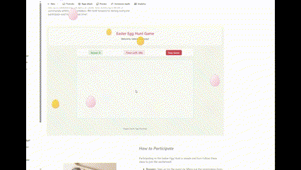

# Easter Egg Hunt Game SPFx Webpart

## Summary

A fun interactive Easter Egg Hunt Game built as a SharePoint Framework web part. This web part creates an engaging, festive activity that allows users to hunt for hidden Easter eggs across a SharePoint page. The game includes regular and bonus eggs with different point values, and eggs can be placed both inside the web part and around other elements on the SharePoint page.



*Note: The game features interactive eggs of various sizes that can be placed throughout your SharePoint page, creating an engaging user experience.*

## Used SharePoint Framework Version


## Applies to

- [SharePoint Framework](https://aka.ms/spfx)
- [Microsoft 365 tenant](https://docs.microsoft.com/en-us/sharepoint/dev/spfx/set-up-your-developer-tenant)

> Get your own free development tenant by subscribing to [Microsoft 365 developer program](http://aka.ms/o365devprogram)

## Prerequisites

- SharePoint Online tenant
- Node.js version 18.17.1 or later (but less than 19.0.0)
- npm (included with Node.js)
- Gulp CLI (installed globally)

## Solution

| Solution              | Author(s)                                       |
|-----------------------|-------------------------------------------------|
| Easter Egg Hunt Game  | Valeras Narbutas                                |

## Version history

| Version | Date             | Comments                                    |
|---------|------------------|--------------------------------------------|
| 0.0.1   | October 28, 2025 | Initial release                            |

## Disclaimer

**THIS CODE IS PROVIDED _AS IS_ WITHOUT WARRANTY OF ANY KIND, EITHER EXPRESS OR IMPLIED, INCLUDING ANY IMPLIED WARRANTIES OF FITNESS FOR A PARTICULAR PURPOSE, MERCHANTABILITY, OR NON-INFRINGEMENT.**

---

## Minimal Path to Awesome

- Clone this repository
  ```bash
  git clone https://github.com/ValerasNarbutas/EasterEggHuntGameSPFXwebpart.git
  cd EasterEggHuntGameSPFXwebpart
  ```
- Install dependencies
  ```bash
  npm install
  ```
- Build and package the solution
  ```bash
  gulp bundle --ship
  gulp package-solution --ship
  ```
- Upload the solution package (located in `sharepoint/solution/easter-egg-hunt-game-spf-xwebpart.sppkg`) to your app catalog
- Add the app to your site
- Add the web part to a page and enjoy the Easter Egg Hunt!

## Features

This Easter Egg Hunt Game SPFx web part offers the following features:

### Game Mechanics
- **Interactive Gameplay**: Users can hunt for eggs by clicking on them when found
- **Multiple Egg Types**: 
  - Regular eggs worth 1-3 points (based on size)
  - Bonus (golden) eggs worth 5-15 points (based on size)
- **Various Egg Sizes**: 
  - Small eggs (30px) - 3x point multiplier (harder to find)
  - Medium eggs (45px) - 2x point multiplier
  - Large eggs (60px) - 1x point multiplier
- **Strategic Scoring**: Eggs found outside the main game area earn 50% bonus points
- **Timer**: Configurable game duration with countdown display
- **Win Conditions**: Game ends when time runs out OR all eggs are found

### Cross-Page Integration
- **Multiple Egg Zones**: Eggs can appear in:
  - Main game area (central playing field)
  - Page header region
  - Page footer region
  - Left sidebar
  - Right sidebar
  - External page elements (via CSS class selectors)
- **Weighted Distribution**: Bonus eggs are more likely to appear outside the main game area
- **External Element Support**: Configure custom CSS classes to place eggs on any page element

### Configuration Options
The web part includes the following property pane settings:
- **Game Duration**: Set the length of the game in seconds (default: 60)
- **Number of Eggs**: Set how many regular eggs to generate (default: 10)
- **Number of Bonus Eggs**: Set how many golden bonus eggs to generate (default: 2, max: 5)
- **Show Game Area**: Toggle whether to show the main game area (default: true)
- **External CSS Classes**: Define classes of external page elements where eggs can appear (semicolon-separated)

### User Experience
- **Responsive Design**: Works well on various screen sizes
- **Accessible Design**: 
  - Support for keyboard navigation (Tab, Enter, Space)
  - Screen reader compatible with ARIA labels
  - High contrast support
- **Visual Feedback**: 
  - Eggs disappear with animation when clicked
  - Real-time score and timer updates
  - Clear game over screen with final score
- **Game Controls**: Start, stop, and restart functionality

## Usage

1. Add the web part to a SharePoint page
2. Configure the game settings in the property pane:
   - **Game Duration**: Set the length of the game in seconds (default: 60)
   - **Number of Eggs**: Set how many regular eggs to generate (default: 10)
   - **Number of Bonus Eggs**: Set how many golden bonus eggs to generate (default: 2)
   - **Show Game Area**: Toggle whether to show the main game area (default: true)
   - **External CSS Classes**: Define CSS classes of external page elements where eggs can appear (semicolon-separated)
3. Click "Start Game" to begin
4. Hunt for eggs throughout the page - eggs can appear in multiple zones:
   - Inside the main game area
   - In the page header
   - In the page footer
   - In left and right sidebars
   - On external page elements (if configured)
5. Click on eggs to collect them and earn points
6. Game ends when all eggs are found or time runs out

## Development

To run the web part locally for development:

```bash
# Install dependencies (if not already done)
npm install

# Start the local development server
gulp serve

# Or, to test with a live SharePoint site
gulp serve --nobrowser
```

Then navigate to your SharePoint site and append the following to the URL:
```
?loadSPFX=true&debugManifestsFile=https://localhost:4321/temp/manifests.js
```

### Building for Production

```bash
# Bundle and minify the solution
gulp bundle --ship

# Package the solution
gulp package-solution --ship
```

The packaged solution will be available at `sharepoint/solution/easter-egg-hunt-game-spf-xwebpart.sppkg`

## Troubleshooting

### Common Issues

**Issue: Build errors related to styling**
- Solution: Ensure you're using Node.js 18.17.1 or a compatible version specified in package.json
- Try cleaning and reinstalling: `npm ci`

**Issue: Eggs not appearing on external elements**
- Solution: Make sure the CSS classes you specified in the property pane actually exist on the page
- Check the browser console for any errors
- Ensure the elements are visible and have sufficient dimensions

**Issue: Web part fails to load**
- Solution: Clear your browser cache and hard refresh (Ctrl+Shift+R or Cmd+Shift+R)
- Check the browser console for specific error messages
- Ensure all dependencies are properly installed with `npm install`

**Issue: Timer not working correctly**
- Solution: This is typically a state management issue. Try stopping and restarting the game

### Debug Mode

To enable detailed logging during development, you can check the browser console for any errors or warnings while the game is running.

## Technical Details

### Architecture

The solution is built using:
- **SharePoint Framework (SPFx) 1.20.0**: Modern development model for SharePoint customizations
- **React 17.0.1**: Component-based UI library
- **TypeScript 4.7.4**: Strongly-typed JavaScript for better development experience
- **Fluent UI React**: Microsoft's design system for consistent UX
- **SCSS Modules**: Scoped styling to avoid CSS conflicts

### Project Structure

```
src/
├── webparts/
│   └── easterEggHuntGame/
│       ├── EasterEggHuntGameWebPart.ts    # Main web part class
│       ├── components/
│       │   ├── EasterEggHuntGame.tsx      # Main React component
│       │   ├── EasterEggHuntGame.module.scss  # Styles
│       │   └── IEasterEggHuntGameProps.ts # TypeScript interfaces
│       └── loc/                           # Localization resources
```

### Key Components

- **EasterEggHuntGameWebPart**: Main SPFx web part class that handles property pane configuration and React component rendering
- **EasterEggHuntGame**: React component managing game state, egg generation, timer logic, and user interactions
- **Egg Zones**: Multiple rendering zones (GameArea, PageHeader, PageFooter, LeftSidebar, RightSidebar, ExternalElements)
- **Portal Rendering**: External element eggs use React portals for DOM manipulation outside the web part

### Game Logic

1. **Initialization**: On component mount, zone dimensions are calculated and external elements are identified
2. **Egg Generation**: Eggs are randomly placed with weighted distribution across zones
3. **Timer Management**: Countdown timer runs every second, ending the game at zero
4. **Score Calculation**: 
   - Base points (1 for regular, 5 for bonus)
   - Size multiplier (3x small, 2x medium, 1x large)
   - Zone bonus (1.5x for eggs outside main game area)
5. **State Management**: React state handles game status, eggs, score, and timer

## References

- [Getting started with SharePoint Framework](https://docs.microsoft.com/en-us/sharepoint/dev/spfx/set-up-your-developer-tenant)
- [Building for Microsoft teams](https://docs.microsoft.com/en-us/sharepoint/dev/spfx/build-for-teams-overview)
- [Use Microsoft Graph in your solution](https://docs.microsoft.com/en-us/sharepoint/dev/spfx/web-parts/get-started/using-microsoft-graph-apis)
- [Publish SharePoint Framework applications to the Marketplace](https://docs.microsoft.com/en-us/sharepoint/dev/spfx/publish-to-marketplace-overview)
- [Microsoft 365 Patterns and Practices](https://aka.ms/m365pnp) - Guidance, tooling, samples and open-source controls for your Microsoft 365 development

## Contributing

Contributions are welcome! If you'd like to contribute to this project:

1. Fork the repository
2. Create a feature branch (`git checkout -b feature/AmazingFeature`)
3. Commit your changes (`git commit -m 'Add some AmazingFeature'`)
4. Push to the branch (`git push origin feature/AmazingFeature`)
5. Open a Pull Request

Please ensure your code follows the existing style and includes appropriate tests.

## Support

If you encounter any issues or have questions:

1. Check the [Troubleshooting](#troubleshooting) section
2. Search existing [GitHub Issues](https://github.com/ValerasNarbutas/EasterEggHuntGameSPFXwebpart/issues)
3. Create a new issue with detailed information about your problem

## License

This project is provided as-is under the terms specified in the disclaimer.

## Acknowledgments

- Built with [SharePoint Framework](https://aka.ms/spfx)
- Inspired by classic Easter egg hunt traditions
- Thanks to the Microsoft 365 community for their continued support and guidance
